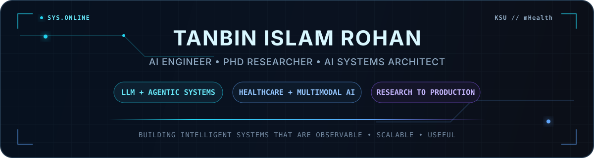

<p align="center">
  
</p>

<p align="center">
  
</p>

<p align="center">
  <a href="https://linkedin.com/in/tanbinislamrohan"></a>
  <a href="https://github.com/tirohan"></a>
  <a href="https://medium.com/@tanbinirohan"></a>
  <a href="mailto:tanbinirohan@gmail.com"></a>
</p>

<p align="center">
  <code>AI ENGINEERING</code> · <code>LLM SYSTEMS</code> · <code>AGENTIC AI</code> · <code>HEALTHCARE AI</code> · <code>MULTIMODAL LEARNING</code>
</p>

---

## `01 // PROFILE`

I build **production AI systems** and conduct research at the intersection of **artificial intelligence, healthcare, biomedical sensing, and intelligent interfaces**.

I am a **Graduate Research Assistant at the mHealth Research Lab, Kennesaw State University** and an **Interdisciplinary PhD researcher in Biomedical & Health Systems**. My work spans privacy-preserving sensing, remote patient monitoring, biomedical signal processing, multimodal learning, trustworthy AI, and research-to-production engineering.

On the engineering side, I have built and deployed **GenAI products, hybrid-RAG systems, agentic workflows, real-time inference services, multimodal ML pipelines, and production APIs**.

> **Mission:** turn strong research ideas into AI systems that are observable, scalable, reproducible, and useful in the real world.

---

## `02 // CURRENT SIGNAL`

| | |
|---|---|
| **Role** | Graduate Research Assistant + PhD Researcher |
| **Institution** | Kennesaw State University |
| **Research** | Healthcare AI · Biomedical Signals · Privacy-Preserving Sensing · Multimodal Learning |
| **Engineering** | LLM Systems · Agentic AI · Hybrid RAG · FastAPI/gRPC · MLOps |
| **Base** | Georgia, USA |

---

## `03 // WHAT I BUILD`

<table>
<tr>
<td width="50%" valign="top">

### `AGT //` Agentic + LLM Systems

Multi-agent workflows, hybrid retrieval, knowledge pipelines, structured extraction, validation, reasoning, and production LLM services.

</td>
<td width="50%" valign="top">

### `HLT //` Healthcare AI

Remote patient monitoring, clinical decision support, health informatics, interpretable ML, uncertainty-aware modeling, and human-centered AI.

</td>
</tr>
<tr>
<td width="50%" valign="top">

### `SNS //` Intelligent Sensing

Wi-Fi CSI, wearable physiology, biomedical signals, time-series modeling, multimodal learning, and non-intrusive sensing.

</td>
<td width="50%" valign="top">

### `OPS //` Production AI

FastAPI, gRPC, containerized inference, CI/CD, cloud AI, observability, data pipelines, and scalable ML deployment.

</td>
</tr>
</table>

---

## `04 // FEATURED RESEARCH`

### 📡 Cross-Modal Knowledge Distillation for Sensor-less Agitation Detection

Transferring information from **wearable physiological signals** to **ambient Wi-Fi CSI** for privacy-preserving agitation detection in Alzheimer's care, with evaluation designed to reduce leakage and shortcut learning.

`Cross-modal learning` `Wi-Fi CSI` `Wearables` `Healthcare AI` `Privacy-preserving sensing`

### 🧬 Electrophysiology + Spiking Neural Networks

Developing and evaluating **spiking neural networks and recurrent spiking architectures** for temporally structured electrophysiological and biomedical signal classification.

`SNNs` `Neuromorphic AI` `Biosignals` `Temporal modeling`

### 💳 AI-Assisted Healthcare Reward Optimization

Contributed to a **$35K industry-funded healthcare AI collaboration with InComm Payments** involving member impact scoring, reward elasticity, causal uplift estimation, claims-validated gap closure, Bayesian ROI simulation, and interpretable ML.

`Causal inference` `Bayesian simulation` `Healthcare analytics` `Interpretable ML`

---

## `05 // ENGINEERING IMPACT`

| Impact | Engineering outcome |
|---|---|
| **35% ↓ latency** | Optimized scalable LLM inference and AI service deployment |
| **40% ↑ accuracy** | Improved production data-science / ML workflows |
| **30% ↓ false positives** | Refined deployed detection and analytics pipelines |
| **35% ↓ extraction errors** | Improved document/OCR intelligence workflows |
| **25% ↑ deployment speed & reliability** | Strengthened containerized CI/CD workflows |
| **15% ↑ accuracy** | Improved multimodal agriculture and weather ML systems |

**Previous roles:** Senior AI Engineer → AI Engineer → Data Scientist → Artificial Intelligence Engineer → Machine Learning Engineer

---

## `06 // TELEMETRY`

<p align="center">
  
  
</p>

<p align="center">
  
</p>

<p align="center">
  
</p>

<p align="center">
  <code>CONTRIBUTION GRID // REGENERATED DAILY</code>
</p>

---

## `07 // TOOLCHAIN`

<p align="center">
  
</p>

<p align="center">
  <code>LangGraph</code> · <code>LlamaIndex</code> · <code>FAISS</code> · <code>gRPC</code> · <code>MLflow</code> · <code>Airflow</code>
</p>

`Hybrid Search` · `BM25 + Dense Retrieval` · `Knowledge Pipelines` · `Agentic Workflows`

---

## `08 // RESEARCH METHODS`

`Statistical Modeling` · `Experimental Design` · `Causal Inference` · `Bayesian Simulation` · `Time-Series Analysis` · `Signal Processing` · `Uncertainty Estimation` · `SHAP Explainability` · `Anomaly Detection`

**Research principles:** participant-aware validation • leakage prevention • generalization testing • uncertainty quantification • interpretable decision support • deployment-aware evaluation

---

## `09 // PUBLICATIONS + RECOGNITION`

I have **7 peer-reviewed publications**, including **2 first-author papers**, across IEEE and Springer venues. My publication history includes machine learning for breast cancer detection, epileptic seizure detection, face liveness, brain-signal analysis, traffic-sign recognition, and emotion classification.

🏆 **IEEE YESIST12 World Finalist** — Thailand, 2019  
🏆 **Combined Champion, IEEE YESIST12** — Khulna Region, Bangladesh, 2019  
🥈 **Runner-up, Project Presentation** — KUET University Day, 2019

---

## `10 // SYSTEM PRINCIPLES`

```text
01  Build useful systems, not impressive demos.
02  Treat data leakage as an engineering failure.
03  Make AI observable before making it autonomous.
04  Prefer reproducible pipelines over clever one-offs.
05  Design research with deployment constraints in mind.
06  Quantify uncertainty when predictions affect people.
07  Bridge research, engineering, and real-world impact.
```

---

<div align="center">

### `CONNECT // COLLABORATE // BUILD`

I am interested in collaborations around **Healthcare AI, LLM systems, RAG, agentic AI, multimodal learning, biomedical sensing, and research-to-production engineering**.

<a href="https://linkedin.com/in/tanbinislamrohan"></a>
<a href="https://github.com/tirohan"></a>
<a href="mailto:tanbinirohan@gmail.com"></a>

<br/><br/>

<sub>Research-driven · Production-minded · Human-centered</sub>

</div>
